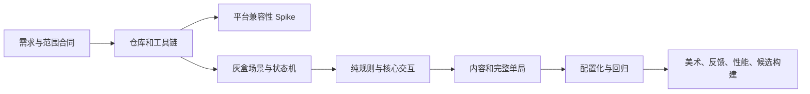

# Unity MVP 大模型协作工程复盘与复用手册

> 适用范围：中小型 Unity 单机 MVP、移动端/WebGL 项目、需要通过 MCP 驱动 Unity Editor 的大模型协作工程。
>
> 本文基于《一笔镇妖》从仓库初始化、Unity 6000.5.1f1/URP 2D 基线、微信小游戏兼容性 Spike，到核心玩法闭环、Excel 配置管线和缺陷修复的实际记录整理。它不是功能说明，而是一套可迁移的工程方法。

## 1. 一页结论

1. 先固定“玩法真相、范围真相、技术真相、任务状态、完成定义”，再让大模型写代码；上下文合同的收益高于任何提示词技巧。
2. 一次只做一个依赖已满足的任务，并为任务写清“不做项”；控制上下文和 diff 大小，是提高正确率最有效的方法之一。
3. Unity 版本、渲染管线、输入系统、平台 SDK 必须在业务开发前做可运行 Spike，不能依赖“理论兼容”。
4. C# 文本编辑和 Unity 序列化资源编辑应走不同工具：代码用文件工具，场景、Prefab、资源导入和 Play Mode 用 Unity MCP。
5. “MCP 服务已启动”不等于“Unity 实例可操作”；每次会话、域重载或重连后都要重新确认实例和 active instance。
6. 纯规则尽量脱离 MonoBehaviour：几何、公式、状态判定放入可直接做 EditMode 测试的代码，场景接线再用 PlayMode 覆盖。
7. 玩家动作必须由事件推进，不能用时间到了替代玩家确认；超时只能表达最短展示时间或兜底策略。
8. 配置必须形成完整契约：Excel 源表、字段字典、导出器、JSON、运行时数据类、校验器、测试缺一不可。
9. “编译通过”和“测试通过”都不等于“玩家路径通过”；真实 Play Mode、可视反馈、连续重开和截图证据是独立验收层。
10. 平台转换成功不等于平台运行成功。缺少开发者工具或真机时，结论只能是 `KNOWN ISSUE` 或 `BLOCKED`，不能写 `PASS`。
11. 每次开始和结束都记录 Git 工作树；Unity/Test Runner 会产生意外序列化改动，必须只处理已确认由本任务产生的文件。
12. 进度文档只保存最新状态和入口，详细日志沉淀到不可变证据目录；这样能降低后续大模型重新读取上下文的成本。

## 2. 本项目形成的工程基线


### 2.2 开发顺序为什么有效

| 阶段 | 主要产出 | 被提前消除的风险 |
|---|---|---|
| Harness | 根 Git、忽略规则、任务树、证据目录 | 嵌套仓库、无边界开发、无法回滚 |
| Unity/MCP 冒烟 | 固定编辑器、URP 2D、场景/测试/Console 链路 | 工具不可用、渲染基线漂移 |
| 平台 Spike | WebGL、微信 SDK 导入与转换 | 做完玩法后才发现平台不兼容 |
| 工程骨架 | asmdef、场景、状态机、竖屏灰盒 | 模块循环依赖、场景职责混乱 |
| 核心规则 | 路径、画线、碰撞、封阵、元素、敕令 | 先做美术导致机制返工成本升高 |
| 内容闭环 | 六波、法诀、Boss、教程、结算、重开 | 单点功能可用但整局不可玩 |
| 配置化 | Excel → JSON → 校验 → 运行时覆盖 | 数值散落、策划无法维护、改动不可审查 |
| 缺陷收敛 | 中文字体、确认后出怪 | 自动测试与真实体验之间的差距 |

推荐把任务依赖维持成一条可验证主链：



## 3. 可迁移的技术经验

### 3.1 用文档建立唯一真相源

本项目把文档职责拆开：

| 文档 | 只回答什么 |
|---|---|
| `GAME_DESIGN_MVP.md` | 玩法规则是什么 |
| `MVP_SCOPE.md` | MVP 做什么、不做什么 |
| `TECH_SPEC.md` | 技术基线和模块边界是什么 |
| `TASKS.md` | 当前允许做哪个原子任务 |
| `PROGRESS.md` | 已完成、风险、下一步是什么 |
| `DECISIONS.md` | 为什么做出偏离默认方案的选择 |
| `BUGS.md` | 已知缺陷的复现、期望、实际和证据 |
| `artifacts/evals/` | 声明是否有可复核证据 |

有效规则是“冲突时按职责裁决”，而不是让模型自行综合出第三种需求。例如玩法冲突以设计规格为准，范围冲突以范围合同为准；需要扩大范围时先写决策，不直接实现。

对其他项目，建议在第一行任务提示中固定读取顺序，并把每份文档限制在单一职责。重复写同一规则会导致版本漂移，也会增加模型比较冲突的时间。

### 3.2 一任务一提交，本质是上下文隔离

任务切片不是项目管理装饰，而是模型正确率控制手段。一个好的任务同时具备：

- 一个可观察目标。
- 明确依赖和状态。
- 明确不做项。
- 预计改动模块。
- 自动测试和真实玩家路径。
- 可保存的证据。
- 一个可回滚提交。

本项目按路径移动、波次、绘制、开放线、封阵、阵眼、敕令、内容、Boss、完整闭环逐步推进。每一步都能建立下一步所依赖的稳定接口，避免模型同时推演所有系统。

反例是“把整个 MVP 做完”：它会让场景引用、状态流转、数值、UI 和测试同时变化，失败后无法判断根因，也无法安全回滚。

### 3.3 规则、Unity 引用和运行状态必须分层

最终形成的边界可以概括为：

- 代码写规则：采样、RDP 简化、闭合、自交、伤害、冷却、状态转换。
- 配置写内容：敌人、波次、刷怪、法诀、平衡值、Boss 阈值、玩家文案。
- Unity 资产写引用：Prefab、Sprite、场景对象、组件关系、ScriptableObject 兜底。
- 运行时对象写状态：当前血量、路径距离、印记、冷却、当前波次、已选法诀。

这个分层让同一套规则既可由 EditMode 直接验证，也能由不同配置和场景复用。最重要的是，不要让 MonoBehaviour Inspector 同时承担内容数据库和运行状态容器。

### 3.4 几何和战斗公式优先纯逻辑化

画线玩法最容易被 Unity 场景噪声掩盖。有效做法是先把以下部分做成无场景或低场景依赖逻辑：

- 最小采样距离和长度精确裁剪。
- Ramer-Douglas-Peucker 简化和最大点数重采样。
- 闭合距离、面积、自交、点在多边形内外。
- 重复线段识别和稳定 `segmentId`。
- 伤害、印记上限、引爆和冷却。

EditMode 负责边界组合，PlayMode 只验证 Collider、事件、Prefab 引用和真实对象生命周期。这样失败时能快速判断是算法、场景接线还是物理时序问题。

### 3.5 路径距离比直接物理位移更适合塔防式敌人

敌人状态使用“沿路径累计距离”，位置由 `WaypointPath.EvaluatePosition(distance)` 计算。风击退只减少路径距离，减速只改变距离增量。

这个设计有三点收益：

- 敌人不会被物理力推离道路。
- 暂停、回退、重启和测试可确定性复现。
- Boss 换路径、环路和抵达终点判定更容易表达。

当项目核心不是寻路时，不要引入 NavMesh/A* 解决固定路线问题。多一套寻路系统会增加平台、性能和测试成本，却不增加核心玩法价值。

### 3.6 玩家确认要用事件门，不要用计时器代替

最典型的流程缺陷是：状态机进入 Drawing，等待 `drawingSeconds` 后自动进入 WaveCombat。代码有“画符阶段”，但玩家不画、不确认也会出怪，违反真实流程。

正确模型是：

1. 进入 Drawing，清理上一波笔迹。
2. 等待可选的最短展示时间。
3. 等待本波有效 `StrokeConfirmed` 事件。
4. 只有事件满足后进入 WaveCombat。
5. 重画/清除会撤销当前确认状态。

这条经验可迁移到准备、匹配、剧情选择、装备确认等流程：计时器描述时间，事件描述用户意图，两者不能互相替代。

流程门变化后，旧的端到端测试也必须更新为主动完成玩家动作，否则测试会挂起或错误地绕过新规则。本项目为波次测试加入自动画线和确认，并新增“确认前绝不生成”的回归测试。

### 3.7 对象池要和状态重置一起设计

池化不只是用栈保存 GameObject。可复用对象必须在 `Begin/Configure` 和 `Stop/Deactivate` 两端明确重置：

- 订阅事件。
- 当前路径和距离。
- 减速、定身、燃烧、冷却。
- 血量、印记和视觉状态。
- 激活/回收计数。

验证重点不是“使用了对象池”，而是连续生成、击杀、到达终点、清场和重开后没有旧状态泄漏。最终闭环测试连续重开三次，就是为了覆盖这一类问题。

### 3.8 Excel 配置化必须是闭环，不是增加一个表

有效配置管线为：

```text
策划 Excel
  → 导出器结构/类型校验
  → 版本化 JSON 快照
  → Unity 数据类反序列化
  → 语义与外键校验
  → GameplayConfigService 单一入口
  → 运行时覆盖引用载体中的兜底值
  → EditMode + PlayMode 回归
```

关键经验：

- 字段名是 API，改名属于契约变更。
- 数组非空、数值范围、唯一 ID、外键、枚举、Boss 阈值顺序都应在启动前校验。
- JSON 坏配置不能半应用；本项目整体验证失败后回退场景兜底。
- ScriptableObject 可保留 Prefab/Sprite 等 Unity 引用，但不再是平衡内容的第二主库。
- 字段含义必须有策划可读字典，不能只看 C# 字段名猜测。
- 任何新增配置字段要同时修改 Excel/模板、JSON、数据类、导出器、校验、文档和测试。

最危险的状态是“双主库”：Excel 和 Inspector 都能改同一数值，但没有明确覆盖优先级。它会让编辑器表现、测试和构建结果不一致。

### 3.9 Unity MCP 需要会话级握手

稳定流程不是直接调用场景工具，而是：

1. 读取 `unity_instances`。
2. 按项目路径选择正确实例。
3. 设置 active instance。
4. 读取项目/场景信息确认 Unity 版本和项目根目录。
5. 再进行场景、Prefab、测试或 Play Mode 操作。

以下情况后要重新握手：Unity 重启、Bridge 重启、域重载、重新打开项目、多个 Unity 实例同时存在、MCP 工具开始返回失联信息。

“Unity 和 MCP 都打开了”仍可能不可用，因为链路至少包含 Unity Editor、MCP package、Bridge/server、端口配置、实例注册和 active instance。诊断要逐层确认，而不是只看进程窗口。

### 3.10 Unity 工具分工能显著降低损坏概率

| 操作 | 首选工具 | 原因 |
|---|---|---|
| C#、Markdown、JSON、asmdef | 文件编辑 + `apply_patch` | diff 清晰、可审查、速度快 |
| GameObject、组件、场景、Prefab | Unity MCP | 避免手改 Unity YAML 和引用 ID |
| Sprite/TMP/音频导入设置 | Unity MCP | 让 Unity 自己生成和保存序列化数据 |
| 编译、Console、Play Mode、测试、Build | Unity MCP | 结果来自真实 Editor 状态 |
| Git 状态、diff、提交 | 命令行 | 精确控制提交边界 |

手工编辑 `.unity`、`.prefab`、`.asset` 文本只应是工具不可用且任务明确允许时的最后选择。

### 3.11 中文 UI 是“文本 + 字体 + 字形 + 回退”问题

把英文字符串改成中文只完成了一半。TextMeshPro 还需要：

- 覆盖中文字符的字体源。
- 合适的 Atlas Population Mode；动态字形或预生成字符集。
- TMP 默认字体和 fallback 设置。
- 场景内已有 TMP 组件实际引用新字体。
- Play Mode 截图确认没有方框、缺字、裁切和混排。

字体 `.asset` 容易被 Unity 因动态 Atlas 或 Inspector 保存而改脏。提交前必须确认它是预期资产变化，不能看到修改就顺手提交。

### 3.12 平台 Spike 的目标是缩小未知，不是证明一切正常

本项目先构建标准 WebGL，再接微信转换 SDK。这样 SDK 失败时，可以判断问题位于平台转换层，而不是基础 WebGL 场景或业务代码。

微信 SDK 固定 commit 在 Unity 6000.5.1f1 上因 `Object.GetInstanceID()` 触发 CS0619。处理流程是：

1. 保留原始错误和上游 commit。
2. 写决策，比较等待官方版本、降级 Unity、做最小本地补丁。
3. 用户确认后将该 commit 固定为 embedded package。
4. 用版本条件仅替换不兼容调用。
5. 记录 `UPSTREAM.md` 和补丁证据，便于未来回到官方版本。

转换器打印 `All done` 只证明生成了项目，不证明开发者工具或真机可运行。缺少外部工具时如实标记 `KNOWN ISSUE`，并输出人工验证步骤。

## 4. 已探索的坑与预防方式

| 坑 | 现象 | 根因 | 有效处理 | 下个项目预防 |
|---|---|---|---|---|
| 根目录和 `game/` 双 Git | 根仓库无法正常追踪 Unity 文件或出现 embedded repo | Unity 项目自身带 `.git` | 删除嵌套 `.git`，只保留根 Git | Bootstrap 第一项检查所有 `.git` 目录 |
| 文档版本与工程不一致 | 任务始终 BLOCKED，模型可能尝试无意义迁移 | 文档基线滞后于实际工程 | 以人工确认的固定版本写决策并统一文档 | `ProjectVersion.txt` 作为机器可查真相 |
| Built-in/URP 混用 | 场景能开但 RendererData 类型错误 | 模板与规格不一致 | 显式验证默认和 Quality Pipeline 的 Renderer2DData | 增加 EditMode 基线测试 |
| MCP 打开但无实例 | 工具存在，场景操作仍失败 | Bridge、端口、实例注册或 active instance 中一层断开 | 逐层读取实例并重新选择 | 每次会话固定做握手，不缓存实例假设 |
| SDK 在新 Unity 编译失败 | 第三方包导入后全工程 CS0619 | 上游使用已移除/禁用 API | 固定 commit，做最小版本条件补丁 | 平台 Spike 前置，记录 upstream 和移除条件 |
| 转换成功被误判为平台 PASS | 有输出目录但设备行为未知 | 把构建阶段和运行阶段混为一谈 | 分 WebGL、转换、开发者工具、真机四级结论 | 验收表为每级单独保存证据 |
| 新 Input System 项目读取旧 Input | 输入代码编译或运行异常 | 项目输入后端与代码 API 不匹配 | Runtime asmdef 引用 `Unity.InputSystem`，统一指针入口 | 基线任务就固定输入后端和抽象接口 |
| Drawing 超时自动出怪 | 玩家未确认也开始战斗 | 时间等待替代用户事件 | 等待有效 `StrokeConfirmed` | 对每个用户门新增“动作前不会推进”测试 |
| 流程门修改后旧测试挂起 | 全量 PlayMode 无法结束 | 测试没有执行新增玩家动作 | 测试主动画线/确认，并保留负向断言 | 测试 helper 按玩家意图命名，不直接跳状态 |
| 中文文本显示方框/异常 | 字符串正确但界面缺字 | TMP 字体不含 glyph 或 fallback 未接通 | 导入中文字体、动态 SDF、默认/回退、截图验证 | UI 基线任务加入常用中文字符样例 |
| PowerShell 读取中文乱码 | 模型看到错误需求文本 | 控制台输出编码与 UTF-8 文件不一致 | 显式设置 UTF-8 OutputEncoding 并重读 | 中文仓库的诊断命令统一 UTF-8 |
| Excel 工作簿无法更新 | 导出器报占用或写回失败 | Excel/其他进程锁定 xlsx | 不强杀进程；先更新 CSV/模板，记录人工关闭后命令 | 工具支持只读校验、独立字段字典和幂等写回 |
| Excel/Inspector 双真相 | Editor、测试、构建表现不一致 | 没有统一覆盖顺序 | JSON 统一入口，SO 只保留引用和兜底 | 启动日志打印配置版本和来源 |
| Test Runner 日志被当成项目错误 | 验证报告误报失败 | Runner 自身保存/清理日志与业务 Console 混合 | 记录基线，按 Error/来源过滤，再做真实 Play Mode 复查 | 区分编译、测试框架和业务三类日志 |
| Unity 测试改脏 ProjectSettings | 任务 diff 出现无关 EditorSettings | Test Runner/Enter Play Mode 设置副作用 | 前后对比，只恢复本轮确定产生的字段 | 每轮先保存 `git status`，结束用文件白名单审查 |
| 逻辑生效但玩家感知弱 | 穿线测试有伤害，玩家仍觉得没掉血 | 闪白、血条、数字、音效或命中时机不清晰 | 同时检查数值状态和可视反馈 | 验收包含“无需看 Console 能否理解结果” |
| 长构建阻塞反馈 | WebGL 单次构建约 573 秒 | 首次导入/编译和 WebGL 构建成本高 | 构建前先跑轻量验证，过程保存 job/日志并持续汇报 | 把构建放在任务末端，缓存稳定依赖 |
| embedded SDK 放大仓库 | 总文件变更显著增加 | 第三方源码被纳入根仓库 | 独立目录、UPSTREAM、固定 commit、补丁最小化 | 定期检查官方兼容版并规划去补丁 |

## 5. 推荐的大模型执行工作流

### 5.1 会话预检

```text
1. 读取 AGENTS/项目指令。
2. 按顺序读取玩法、范围、技术、当前任务、进度。
3. git status --short --branch，记录用户已有改动。
4. 从 TASKS 选择第一个 READY 且依赖为 DONE 的任务。
5. 复述目标、不做项、验收路径和预计改动文件。
6. 若需 Unity，读取 unity_instances 并设置正确 active instance。
```

不要一上来扫描整个 `Library/` 或读取全部源码。先用 `rg --files` 和 `rg` 建立相关模块清单，只读当前任务直接依赖的文件。权威文档完整读取，代码按调用链逐层展开。

### 5.2 实施前写“改动白名单”

在模型开始编辑前，先预估：

- 运行时代码文件。
- 测试文件。
- 配置和字段文档。
- 场景/Prefab/资源。
- 证据和进度文档。

完成后把实际 diff 与白名单比较。新增文件若无法解释，先调查，不直接纳入提交。

### 5.3 最小反馈环

推荐顺序：

```text
小范围代码修改
→ 静态/脚本校验
→ Unity refresh 和编译
→ Console Error 检查
→ 相关 EditMode
→ 相关 PlayMode
→ 真实场景玩家路径
→ 全量回归
→ diff/check/status
```

不要先堆积大量改动再启动 Unity。Unity 领域重载、序列化和场景引用错误越晚发现，定位成本越高。

### 5.4 验证金字塔

| 层 | 回答的问题 | 典型手段 |
|---|---|---|
| L0 文本/结构 | 文件、命名空间、asmdef、配置结构是否正确 | `rg`、导出器、语法检查 |
| L1 纯逻辑 | 算法和公式边界是否正确 | EditMode |
| L2 Unity 集成 | Collider、Prefab、事件和场景引用是否接通 | PlayMode |
| L3 玩家路径 | 按钮、流程、反馈是否符合体验 | 真实 Play Mode + 截图 |
| L4 稳定性 | 重启、暂停、重复进入、压力下是否泄漏 | 连续运行/Profiler/全量回归 |
| L5 平台 | 构建、转换、开发者工具、真机是否成立 | 平台分级证据 |

任何层失败都不能用更高层的一次偶然成功覆盖。例如截图看起来正常，不能替代配置校验；测试全绿，也不能替代微信真机。

### 5.5 证据模板

每个任务至少保存一个 `artifacts/evals/TASK-ID/verification.md`：

```markdown
# TASK-ID Verification

- 日期：
- Git commit/branch：
- Unity 版本与 instance：
- 范围：做了什么、明确没做什么
- 脚本校验：
- EditMode：总数/通过/失败
- PlayMode：总数/通过/失败
- 真实玩家路径：步骤与观察值
- Console：新增 Error/Warning
- 截图/日志：相对路径
- 已知问题：
- 结论：PASS / REVIEW / BLOCKED / KNOWN ISSUE
```

证据尽量包含可断言数值，例如“HP 20→10、印记 1、速度倍率 0.8”，而不只写“看起来正常”。

### 5.6 提交前检查

```text
1. 退出 Play Mode，保存场景/Prefab/资产。
2. 刷新并确认没有新增编译错误。
3. git diff --check。
4. git status 与任务开始时的基线比较。
5. 检查假实现、未接按钮、隐藏 TODO、测试专用捷径进入正式代码。
6. 只暂存本任务文件。
7. git diff --cached 再审一次。
8. 创建一个带 TASK-ID 的原子提交。
```

## 6. 提升大模型探索与工作效率的具体改进

| 优先级 | 改进 | 预期收益 |
|---|---|---|
| P0 | 为所有任务维护依赖、状态、不做项、验收路径 | 防止跨任务扩散，减少错误实现 |
| P0 | 建立一页上下文索引，链接权威文档和当前入口 | 降低每次会话重新发现成本 |
| P0 | 每个系统至少有一个可筛选的专项测试类 | 修改后先跑小集合，缩短反馈时间 |
| P0 | 会话开始/结束自动保存 Git 状态快照 | 防止覆盖用户改动和误提交 Unity 噪声 |
| P1 | 建立“任务 → 代码模块 → 测试 → 场景 → 证据”映射表 | 模型能快速确定最小读取和验证范围 |
| P1 | 配置导出、字段字典、JSON diff 做成一个幂等命令 | 避免配置契约只更新一半 |
| P1 | 让启动日志输出配置版本、来源和校验摘要 | 快速发现 JSON/SO 双真相 |
| P1 | 为 MCP 写固定重连检查清单 | 减少“工具开着但实例不可用”的反复诊断 |
| P1 | 给人工外部步骤单独建状态，不混入自动任务 PASS | 避免模型伪造开发者工具/真机结论 |
| P2 | 自动生成证据摘要和测试计数 | 减少手写进度文档漂移 |
| P2 | 对长构建保存 job ID、耗时、体积和日志摘要 | 中断后可续查，不必重做整个探索 |
| P2 | 定期压缩 `PROGRESS.md`，细节只留在 evidence/commit | 控制上下文长度，提高后续阅读效率 |

### 6.1 推荐新增的轻量机器可读索引

类似项目可维护一个简短 YAML/JSON，不替代人类文档，只用于快速定位：

```yaml
current_task: TASK-410
unity_version: 6000.5.1f1
active_scene: Assets/_Game/Scenes/Battle_MVP.unity
task_tests:
  TASK-210:
    editmode: OneStrokeDemon.Tests.Task210OpenRuneTests
    playmode: OneStrokeDemon.Tests.Task210OpenRunePlayModeTests
task_evidence:
  TASK-210: artifacts/evals/TASK-210/verification.md
manual_gates:
  wechat_devtools: pending
  phone_smoke: pending
```

它能让模型先定位，再按项目指令读取完整权威文档；不能把摘要当成需求真相。

### 6.2 探索顺序应从“接口”向“实现”展开

高效代码阅读顺序：

1. 当前任务合同和测试名。
2. 场景入口/Bootstrap。
3. 对外事件、接口和序列化字段。
4. 纯规则实现。
5. Prefab/场景引用。
6. 相关历史提交和缺陷证据。

先读所有实现文件会被细节淹没。先看接口和测试，能快速建立“输入、输出、状态、失败条件”的模型。

### 6.3 诊断时先构造可证伪假设

以“敌人穿线似乎不掉血”为例，不应直接重写碰撞代码。先分层验证：

1. 笔迹是否确认并生成有效 Trigger。
2. Enemy 是否有正确 Layer/Collider/Rigidbody2D。
3. Trigger 是否触发一次，`segmentId` 冷却是否误拦截。
4. Damageable HP 是否变化。
5. 敌人是否过快死亡/回池导致看不到血量。
6. 闪白、血条、音效是否足够让玩家感知。

每一步都能排除一类根因，避免“看起来不对”触发大范围猜测性修改。

## 7. 可直接复制的提示词模板

### 7.1 新项目 Bootstrap

```text
先不要写业务代码。
1. 读取项目指令和全部权威文档，列出冲突。
2. 检查 Git 根、嵌套仓库、忽略规则、Unity 目录和已有改动。
3. 核对 Unity 精确版本、渲染管线、输入系统和目标平台。
4. 检查 Unity MCP 实例；不可用时只列人工前置，不伪造完成。
5. 建立任务依赖、状态、完成定义和证据目录。
6. 只完成仓库/Harness 初始化，不实现玩法。
7. 验证、记录证据、审查 diff 后创建原子提交。
```

### 7.2 执行下一个任务

```text
读取项目指令、玩法真相、范围真相、技术规格、TASKS 和 PROGRESS。
只选择第一个 READY 且依赖均为 DONE 的任务。
先说明目标、不做项、验收路径、预计改动文件和风险。
保护现有工作树；需要 Unity 时先确认 active instance。
按最小反馈环实现，并运行相关 EditMode、PlayMode、真实玩家路径和 Console 检查。
证据保存到 artifacts/evals/TASK-ID/。
检查未接引用、状态泄漏、硬编码配置和无关 diff。
通过后更新文档并创建一个原子提交；未通过则如实标记 REVIEW/BLOCKED。
```

### 7.3 缺陷诊断

```text
先诊断，不先改代码。
读取缺陷涉及的设计规则、当前实现、测试、场景引用和最近相关提交。
把问题拆为：输入、状态门、几何/物理、数值、对象生命周期、视觉反馈、平台差异。
给出可复现步骤、观察值、最可能根因和最小修复范围。
若用户要求修复，再补回归测试、真实 Play Mode 验收、证据和原子提交。
```

### 7.4 独立验收

```text
不要默认相信实现者说明，也不要先改代码。
从任务合同重新执行玩家路径，检查 Console、场景引用、边界条件和连续重试。
将结论严格分为 PASS、PASS WITH MINOR ISSUES、FAIL。
每个问题写严重级、复现、期望、实际、证据和建议修复范围。
缺少外部工具或真机时，不得把结果写成 PASS。
```

## 8. 复用清单

### 8.1 新 Unity 项目

- [ ] 根目录只有一个 Git，Unity 子目录无 `.git`。
- [ ] `Library/Temp/Logs/UserSettings/Builds` 已忽略。
- [ ] Unity 精确版本和模块已固定。
- [ ] Render Pipeline Asset 和 RendererData 已实际验证。
- [ ] 输入后端和输入抽象已固定。
- [ ] Runtime/Editor/EditMode/PlayMode asmdef 已分离。
- [ ] MCP 实例、场景保存、Play Mode、Console、测试链路已冒烟。
- [ ] 目标平台最小场景 Spike 在业务前执行。
- [ ] 任务树、完成定义、证据目录和提交格式已建立。

### 8.2 每个功能任务

- [ ] 只做一个 READY 任务。
- [ ] 写明不做项和预计改动白名单。
- [ ] 数值/文案/内容列表是否需要配置化已判断。
- [ ] 纯逻辑有 EditMode 边界测试。
- [ ] Unity 引用和生命周期有 PlayMode 测试。
- [ ] 真实玩家路径在目标场景执行。
- [ ] 暂停、重开、重复进入和清理已考虑。
- [ ] Console 无新增阻断错误。
- [ ] 证据包含数值、日志或截图，不只有结论。
- [ ] diff 没有用户改动、自动生成噪声和后续任务内容。

### 8.3 配置变更

- [ ] Excel 源表/模板已更新。
- [ ] 字段字典已更新。
- [ ] 导出器已更新并可幂等执行。
- [ ] JSON 快照已更新。
- [ ] 运行时数据类已更新。
- [ ] 唯一性、范围、枚举、外键和跨字段关系已校验。
- [ ] 配置版本和兼容性已考虑。
- [ ] 专项与全量测试已通过。
- [ ] 没有在 C# 或 Inspector 新增第二份内容真相。

### 8.4 平台兼容性 Spike

- [ ] 固定引擎、平台 SDK、commit 和构建模块。
- [ ] 最小场景仅含输入、显示、音频和日志。
- [ ] 标准目标构建先通过。
- [ ] 平台转换单独执行并保存原始日志。
- [ ] 本地补丁有决策、版本条件、UPSTREAM 和移除条件。
- [ ] 开发者工具和真机结果分别记录。
- [ ] 未执行的层明确写 `KNOWN ISSUE/BLOCKED`。
- [ ] 构建产物、耗时、体积和警告有记录。

## 9. 哪些内容不能机械复制

以下是本项目特定选择，不是普遍真理：

- Unity `6000.5.1f1`、URP 2D Renderer 和微信 SDK commit。
- uGUI + TextMeshPro、Resources JSON、ScriptableObject 兜底。
- 预设 WaypointPath、两条道路、六波、三个敌人和三阶段 Boss。
- `GetEntityId().GetHashCode()` 的微信 SDK 补丁。

可机械复制的是选择过程：固定版本、先 Spike、最小补丁、保存上游信息、分级验证、保留移除条件。新项目应重新验证具体技术选择。

## 10. 后续项目建议的成熟度门槛

| 等级 | 条件 |
|---|---|
| 可开发 | 需求/范围/技术基线一致，Git 和 Unity MCP 冒烟通过 |
| 可集成 | 纯规则、场景接线和核心玩家路径分别有测试 |
| 可试玩 | 完整单局、失败/胜利/重开、可感知反馈通过 |
| 可配置 | 内容数据有单一来源、导出、校验、字段文档和回归 |
| 可候选 | 全量回归、性能、目标构建、平台工具和真机证据通过 |

不要跨级宣布完成。尤其是“可试玩”和“可候选”之间，平台、性能、正式资源和真机交互仍可能暴露结构性问题。

## 11. 本文依据

- 需求与范围：`docs/GAME_DESIGN_MVP.md`、`docs/MVP_SCOPE.md`、`docs/TECH_SPEC.md`
- 任务与进度：`docs/TASKS.md`、`docs/PROGRESS.md`
- 决策与缺陷：`docs/DECISIONS.md`、`docs/BUGS.md`
- 配置：`docs/CONFIG_PIPELINE.md`、`docs/CONFIG_SCHEMA.md`
- 平台：`docs/PLATFORM_SPIKE.md`、`docs/UNITY_MCP_SETUP.md`
- 测试：`docs/TEST_PLAN.md`
- 执行模板：`prompts/00_BOOTSTRAP.md`、`prompts/01_NEXT_TASK.md`、`prompts/02_EVALUATE.md`、`prompts/04_WECHAT_SPIKE.md`
- 任务证据：`artifacts/evals/TASK-*`、`artifacts/evals/BUG-0005`、`artifacts/evals/CONFIG-*`

最后更新：2026-07-11。
